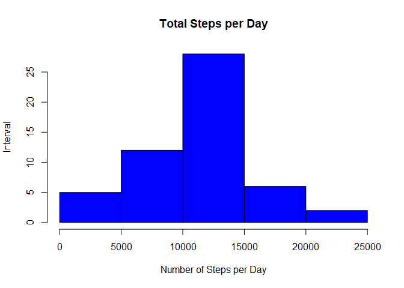
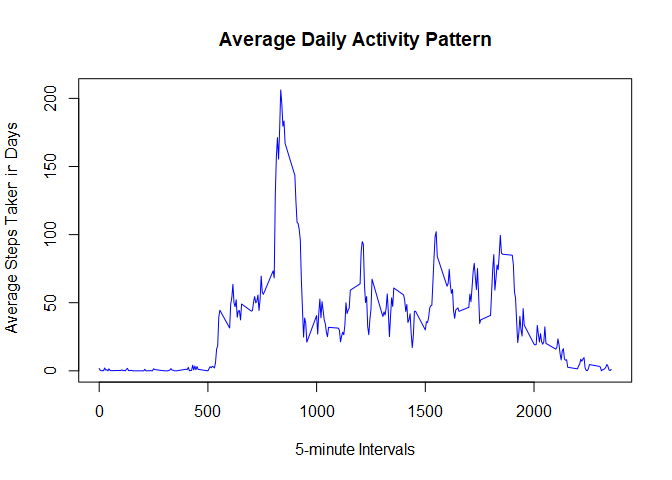
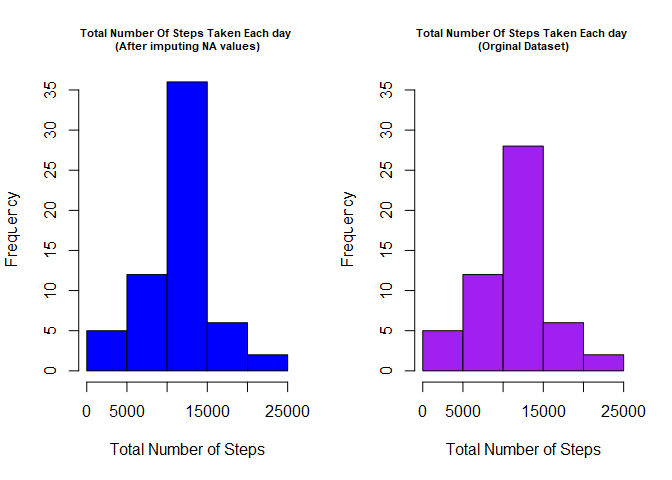
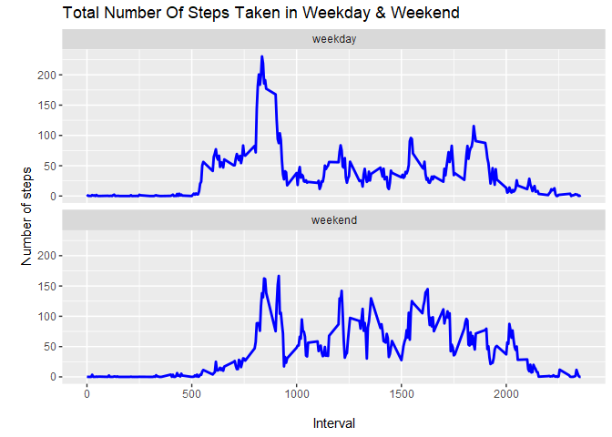

## Libraries


```r
require(dplyr)
require(ggplot2)
require(lubridate)
```

## Loading and preprocessing the data
The dataset “Activity monitoring data” contains steps, date and interval variables. After observing and cleaning the data,we are able to answer all the questions.
After downloading the data file into the working directory,read the data.

```r
activity <- read.csv("activity.csv",header=T)
```

## What is mean total number of steps taken per day?
The mean of total number of steps taken per day is 10766.19. The median of total number of steps taken per day is 10765.

```r
totalstepsperday <- aggregate(steps ~ date, data = activity, FUN = sum, na.rm = TRUE)
head(totalstepsperday)
```

```
##         date steps
## 1 2012-10-02   126
## 2 2012-10-03 11352
## 3 2012-10-04 12116
## 4 2012-10-05 13294
## 5 2012-10-06 15420
## 6 2012-10-07 11015
```

```r
hist(totalstepsperday$steps, main="Total Steps per Day", xlab="Number of Steps per Day",  ylab = "Interval", col="blue")
```

<!-- -->

Calculate the mean and median.

```r
msteps <- mean(totalstepsperday$steps)
msteps
```

```
## [1] 10766.19
```

```r
medsteps <- median(totalstepsperday$steps)
medsteps
```

```
## [1] 10765
```

## What is the average daily activity pattern?
The 835 5-min interval contains the maximum number of steps on average across all the days in the dataset, which is 10927 steps.

```r
## five minute average using steps to interval - FUN = mean instead of sum
activity <- read.csv("activity.csv",header=T)
fivemin <- aggregate(steps ~ interval, data = activity, FUN = mean, na.rm = TRUE)
## line chart
plot(x = fivemin$interval, 
     y = fivemin$steps, 
     type = "l", 
     col = "blue",
     xlab = "5-minute Intervals",
     ylab = "Average Steps Taken in Days",
     main = "Average Daily Activity Pattern")
```

<!-- -->


```r
#Which 5-minute interval, on average across all the days in the dataset, contains the maximum number of steps?
maxsteps <- fivemin[which.max(fivemin$steps),]
maxsteps
```

```
##     interval    steps
## 104      835 206.1698
```

## Imputing missing values
Some values are different from the estimates from the first part of the assignment (original data) since NA values are removed, the mean is still the same but median will be affected, which differs from original data by 1.19.


```r
activity <- read.csv("activity.csv",header=T)
table(is.na(activity))
```

```
## 
## FALSE  TRUE 
## 50400  2304
```

```r
#Devise a strategy for filling in all of the missing values in the dataset. The strategy does not need to be sophisticated.#In the original data set aggregating (mean) steps over 5-minute interval
meaninterval<- aggregate(steps ~ interval, activity, FUN=mean)
anew <- merge(x=activity, y=meaninterval, by="interval")
anew$steps <- ifelse(is.na(anew$steps.x), anew$steps.y, anew$steps.x)
head(anew)
```

```
##   interval steps.x       date  steps.y    steps
## 1        0      NA 2012-10-01 1.716981 1.716981
## 2        0       0 2012-11-23 1.716981 0.000000
## 3        0       0 2012-10-28 1.716981 0.000000
## 4        0       0 2012-11-06 1.716981 0.000000
## 5        0       0 2012-11-24 1.716981 0.000000
## 6        0       0 2012-11-15 1.716981 0.000000
```

```r
#Create a new dataset that is equal to the original dataset but with the missing data filled in.
anew <- select(anew, steps, date, interval)
head(anew)
```

```
##      steps       date interval
## 1 1.716981 2012-10-01        0
## 2 0.000000 2012-11-23        0
## 3 0.000000 2012-10-28        0
## 4 0.000000 2012-11-06        0
## 5 0.000000 2012-11-24        0
## 6 0.000000 2012-11-15        0
```

Plotting the graph

```r
totalstepsperday <- aggregate(steps ~ date, data = activity, FUN = sum, na.rm = TRUE)
totalsteps_new<- aggregate(steps ~ date, anew, FUN=sum)

#Plotting
#Setting up the pannel for one row and two columns
par(mfrow=c(1,2))

#Histogram after imputing NA values with mean of 5-min interval
hist(totalsteps_new$steps, 
     col="blue",
     xlab = "Total Number of Steps", 
     ylab = "Frequency",
     ylim = c(0,35),
     main = "Total Number Of Steps Taken Each day \n(After imputing NA values)",
     cex.main = 0.7)

#Histogram with the orginal dataset
hist(totalstepsperday$steps, 
     col="purple", 
     xlab = "Total Number of Steps", 
     ylab = "Frequency",
     ylim = c(0,35),
     main = "Total Number Of Steps Taken Each day \n(Orginal Dataset)",
     cex.main = 0.7)
```

<!-- -->

Calculate the means and medians


```r
msteps <- mean(totalstepsperday$steps)
msteps
```

```
## [1] 10766.19
```

```r
medsteps <- median(totalstepsperday$steps)
medsteps
```

```
## [1] 10765
```

```r
msteps_new <- mean(totalsteps_new$steps)
msteps_new
```

```
## [1] 10766.19
```

```r
medsteps_new <- median(totalsteps_new$steps)
medsteps_new
```

```
## [1] 10766.19
```

```r
#Comparing Means
paste("New Mean      :", round(msteps_new,2), "," ,  
      " Original Mean :", round(msteps,2),"," , 
      " Difference :",round(msteps_new,2) -  round(msteps,2))
```

```
## [1] "New Mean      : 10766.19 ,  Original Mean : 10766.19 ,  Difference : 0"
```

```r
#Comparing Medians
paste("New Median    :", medsteps_new, ",", 
      " Original Median :", medsteps,"," , 
      " Difference :",round(medsteps_new-medsteps,2))
```

```
## [1] "New Median    : 10766.1886792453 ,  Original Median : 10765 ,  Difference : 1.19"
```

## Are there differences in activity patterns between weekdays and weekends?
Yes, the number of steps taken in weekday is higher than in weekend. Perhaps most of people are working in weekday so the steps taken is higher.


```r
#Create a new factor variable in the dataset with two levels – “weekday” and “weekend” indicating whether a given date is a weekday or weekend day.
library(chron)
table(is.weekend(anew$date))
```

```
## 
## FALSE  TRUE 
## 12960  4608
```

```r
anew$dayofweek <- ifelse(is.weekend(anew$date), "weekend", "weekday")
table(anew$dayofweek)
```

```
## 
## weekday weekend 
##   12960    4608
```

```r
meaninterval_new<- aggregate(steps ~ interval + dayofweek, anew, FUN=mean)
head(meaninterval_new)
```

```
##   interval dayofweek      steps
## 1        0   weekday 2.25115304
## 2        5   weekday 0.44528302
## 3       10   weekday 0.17316562
## 4       15   weekday 0.19790356
## 5       20   weekday 0.09895178
## 6       25   weekday 1.59035639
```

```r
ggplot(meaninterval_new, aes(x=interval, y=steps)) + 
        geom_line(color="blue", size=1) + 
        facet_wrap(~dayofweek, nrow=2) +
        labs(x="\nInterval", y="\nNumber of steps", title = "Total Number Of Steps Taken in Weekday & Weekend")
```

<!-- -->
